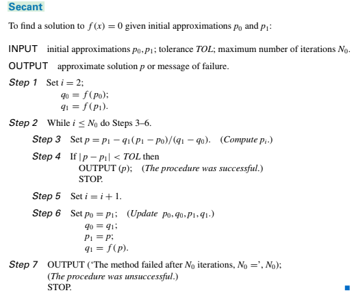
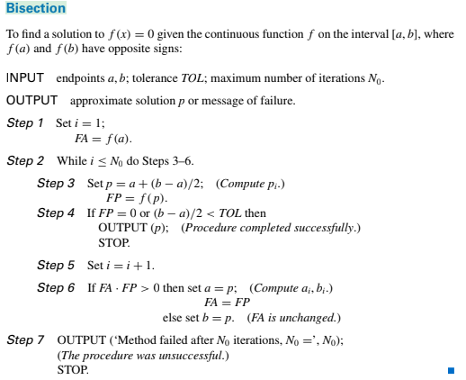

可使用下述程式碼把markdown格式轉成word
```
pandoc -o output.docx -f markdown -t docx input.md
```

## 整個 method 架構的程式碼

過後再細步考慮每個方法的程式邏輯 。

```
class method:
    '''
    >> method(f,fx).newton(1,1e-15,500)
    1.414213562373095
    '''
    def __init__(self,f,fx):
        self.f = f
        self.fx = fx

    '''
    newton 牛頓法
    '''
    def newton(self,xo,tol,no):
        '''
        xo : initial approximation  , zero can't be use
        TOL : tolerance  
        no : maximum number of iterations
        f : function
        fx : derative function
        '''
        i = 0
        while i <= no :
            try:
                f1 = self.f(xo)
                f2 = self.fx(xo)
                x = xo - (  f1 / f2 ) 
            except ZeroDivisionError:
                continue
            if np.abs(x-xo) < tol :
                return x
                break 
            i+=1
            xo = x
        return float('nan')

    '''
    secant 割綫法
    '''
    def secant(self , po , p1 , tol , no):
        '''
        po , p1 : initial approximations
        TOL : tolerance
        no : maximum number of iterations
        '''
        i = 0
        qo = self.f(po)
        q1 = self.f(p1)
        while i <= no : 
            p = p1 - q1*(p1-po) / (q1 - qo)
            if np.abs(p - p1) < tol :
                return p
                break 
            i+=1
            po , qo , p1 , q1 = p1 , q1 , p , self.f(p)
        return float('nan')

    '''
    bisection method 二分法
    '''
    def bisection(self , start , end , tol , no , f):
        '''
        start : start points 
        end : end points 
        tol : tolerance 
        no : maximum number of iterations 
        '''
        i = 1 
        st = start
        et = end
        fa = self.f(st)
        while i <= no:
            p = st + (et-st)/2
            fp = self.f(p)
            if fp == 0 or (et-st)/2 < tol :
                return p
                break
            i+=1
            if fa * fp > 0 :
                st , fa  = p , fp
            elif fa * fp < 0 : 
                et = p
        return float('nan')
```

## 怎麽使用 

當你不知道要放什麽時 , 可以輸入 ``` help(df.bisection)```

```
>> help(df.bisection)

Help on method bisection in module __main__:

bisection(start, end, tol, no) method of __main__.method instance
    start : start points 
    end : end points 
    tol : tolerance 
    no : maximum number of iterations
```


使用類別的方法

```
>> df = method(f,fx)
>> df.newton(1,1e-15,500) , df.secant(0,1,1e-15,500) , df.bisection(0.1,0.2,1e-15,500)

(1.414213562373095, 1.4142135623730951, 0.1999999999999993)
```

## 問題呈現

突然發現 bisection 的結果與其他方法結果不一樣 。
那 ```0.1999999999999993``` 是他的解嗎 ? 

那爲什麽呢? 

那是因爲在 bisection 裏 a, b 是 範圍 , bisection 只對 a ,b 裏求解 。 

我們再重新定義bisection , start point 和 end point 

```
 >> df.bisection(0,2,1e-15,500)
 1.414213562373095
```

如果避免這個問題呢? 以及求範圍值 。

Using Intermediate Value Theorem Fix this Problem , How ? 

尋找 ```+- or -+``` 的形態的值 表示 根在兩者之間 。

```
>> f(0.1) , f(2)
(-1.99, 2)
```

## pseudo code

### newton 


### secant



### bisection



參考書籍 : Numerical Analysis , Richard L. Burden and J. Douglas Faires
