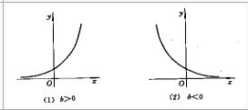

## Linear Regression

$$ y = \beta_1 * x_1 + \beta_2 * x_2 + ... + \epsilon $$ 

其中 :

> y 

因變量

> x

自變量

> $\beta$

估計值 , 用來擬合因變量

> $\epsilon$

誤差項

## Non Linear Regression 

$$ y = a*\exp^{bx}$$

$$ ln(y) = ln(a) + b*x $$

$$ y = a  + b*x$$

其中 

> a = ln(a)

參考資料 : 

https://online.stat.psu.edu/stat501/lesson/15/15.7

https://wiki.mbalib.com/zh-tw/%E9%9D%9E%E7%BA%BF%E6%80%A7%E5%9B%9E%E5%BD%92%E9%A2%84%E6%B5%8B%E6%B3%95